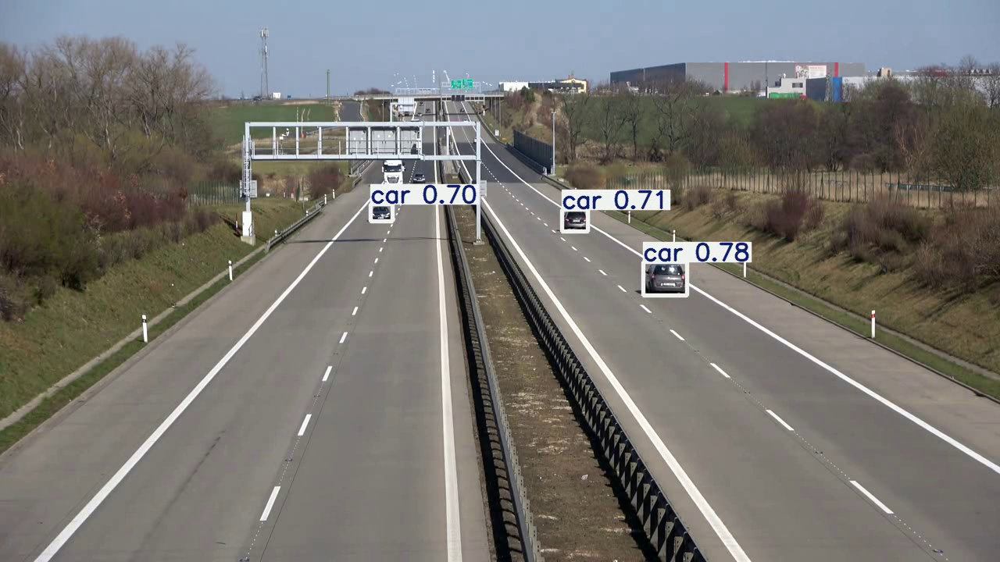

# 🚗 Vehicle Speed Detection System

<p align="center">
  
</p>

Real-time **Vehicle Speed Detection System** using **YOLO11 + Perspective Transform + ByteTrack**. This project accurately estimates vehicle speeds by mapping the camera view to a top-down perspective.

---

## 🎯 Results

| Metric | Value |
|--------|-------|
| **Speed Accuracy** | ±5 km/h |
| **Detection FPS** | 30+ |
| **Vehicle Types** | Cars, Trucks, Buses |
| **Multi-Object Tracking** | ✓ ByteTrack |
| **Perspective Correction** | ✓ |

### How It Works

1. **Object Detection**: YOLO11 detects all vehicles in frame
2. **Perspective Transform**: Camera view mapped to bird's-eye view
3. **Object Tracking**: ByteTrack assigns unique IDs
4. **Speed Calculation**: Distance/time between frames → speed in km/h

### Speed Color Coding
- 🟢 **Green Box**: Normal speed (< 50 km/h)
- 🔴 **Red Box**: Over-speeding (> 100 km/h)

---

## ✨ Features

- **Real-time Speed Estimation**: Accurate vehicle speed calculation
- **Perspective Transform**: Corrects camera distortion for accurate measurements
- **Multi-Vehicle Tracking**: Track multiple vehicles simultaneously with ByteTrack
- **Color-coded Alerts**: Visual speed violation indicators
- **Video Output**: Generates annotated video with speed labels

### 🎥 Output Video

The processed output video with speed annotations is available at:
- `outputs/yolo_output/vehicles1280x720.avi` (15 MB)

---

## 🛠️ Tech Stack

| Category | Technology |
|----------|------------|
| **Object Detection** | YOLO11 (Ultralytics) |
| **Tracking** | ByteTrack |
| **Computer Vision** | OpenCV |
| **Annotation** | Supervision |
| **Deep Learning** | PyTorch |
| **Environment** | Python 3.12, Conda |

---

## 🚀 Installation

```bash
# Clone the repository
git clone https://github.com/Abdul-Insighht/Vehicle-Speed-Detection-System.git
cd Vehicle-Speed-Detection-System

# Create conda environment
conda create -n cv python=3.12 -y
conda activate cv

# Install dependencies
pip install -r requirements.txt

# Or install manually
pip install numpy pandas opencv-python ultralytics supervision
```

## 📝 Usage

```bash
# Run speed detection on video
python main.py --video path/to/traffic_video.mp4

# Run the app
python app.py
```

---

## 📚 Resources

- **YOLO**: [Ultralytics](https://github.com/ultralytics/ultralytics)
- **Roboflow**: [GitHub](https://github.com/roboflow)
- **Supervision**: [Docs](https://supervision.roboflow.com/latest/)

---

## 📬 Contact

**Hafiz Abdul Rehman**

- 📧 Email: hafizrehman3321@gmail.com
- 💼 LinkedIn: [Hafiz Abdul Rehman](https://linkedin.com/in/hafiz-abdul-rehman-9990ab329)
- 🐙 GitHub: [Abdul-Insighht](https://github.com/Abdul-Insighht)

---

## 🌟 Show Your Support

If you find this project helpful, please consider:

- ⭐ **Starring** this repository
- 🔄 **Sharing** with others
- 🐛 **Reporting** issues
- 💡 **Suggesting** improvements

---

<p align="center">Made with ❤️ by <b>Hafiz Abdul Rehman</b></p>
<p align="center">🚗💨 Automating vehicle identification with AI and computer vision</p>
